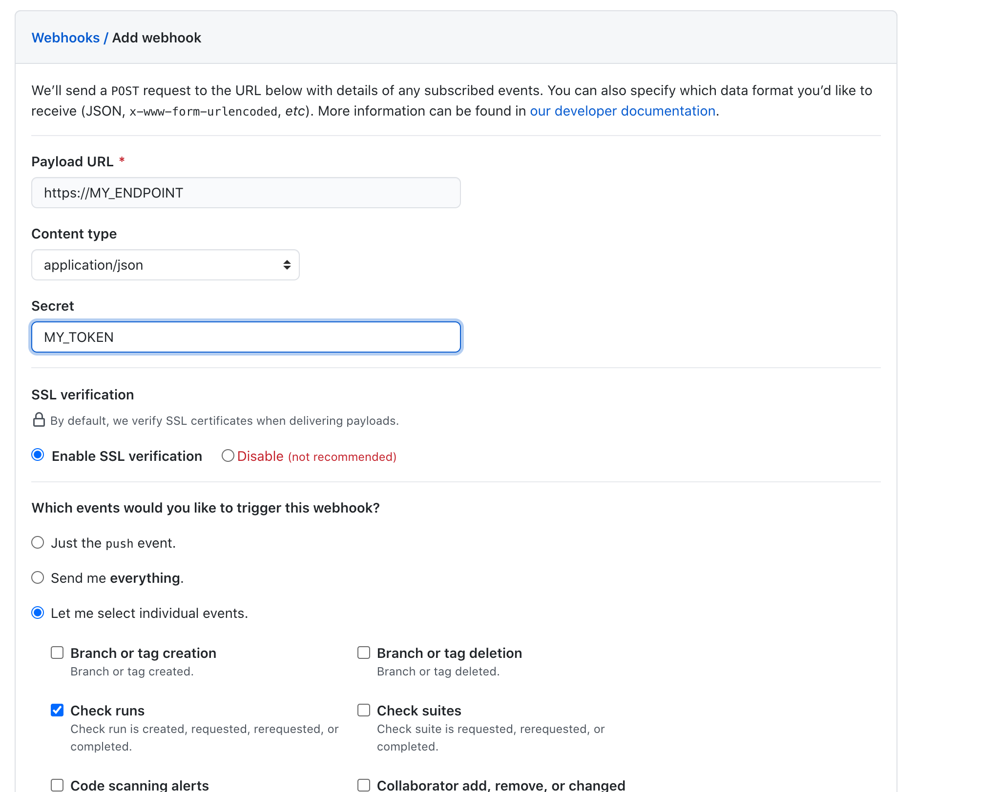

# GitHub Actions Exporter

Prometheus exporter exposing [GitHub Actions](https://github.com/features/actions) metrics.

Right now this exporter only expose the one metric which is the WorkFlow execution
time.

Other metrics can be added in the future.

## Getting Started

This exporter receives webhook events from GitHub.

If you want to collect metrics from a GitHub repository you will need to create a webhook
in your GitHub repo.

You need just to select the `Check Run` event and the set your secret (that you start your exporter, see below)

The webhook will call `/gh_event` path on your endpoint by default. You can change this with the `--web.gh-webhook-path` option.



Also it collects the Action Billing metrics, for that you will need to setup a GitHub API Access Token

When configuring for an organization Access tokens must have the `repo` or `admin:org` scope.
When configuring for an user Access tokens must have the `user` scope.


### Prerequisites

To run this project, you will need a [working Go environment](https://golang.org/doc/install).

### Installing

```bash
go get -u github.com/cpanato/github_actions_exporter
```

## Building

Build the sources with

```bash
make build
```

## Run the binary

```bash
./github_actions_exporter --gh.github-webhook-token="MY_TOKEN" --gh.github-api-token="Accesstoken" --gh.github-org="honk_org"
```

## Docker

You can deploy this exporter using the [ghcr.io/cpanato/github_actions_exporter-linux-amd64](https://github.com/users/cpanato/packages/container/package/github_actions_exporter-linux-amd64) Docker image.

For example:

```bash
docker pull ghcr.io/cpanato/github_actions_exporter-linux-amd64:v0.2.0
docker run -d -p 9101:9101 ghcr.io/cpanato/github_actions_exporter-linux-amd64:v0.2.0 --gh.github-webhook-token="1234567890token" --gh.github-api-token="Accesstoken" --gh.github-org="honk_org"
```

## Testing

### Running unit tests

```bash
make test
```

### Manual testing

```bash
cd example/
export GITHUB_WEBHOOK_TOKEN="..."
export GITHUB_TOKEN="..."
export GITHUB_ORG="..."
docker-compose up --build
```

Open Prometheus at http://localhost:9090 and explore the available metrics.

## Contributing

Refer to [CONTRIBUTING.md](https://github.com/cpanato/github_actions_exporter/blob/master/CONTRIBUTING.md).

## License

Apache License 2.0, see [LICENSE](https://github.com/cpanato/github_actions_exporter/blob/master/LICENSE).
