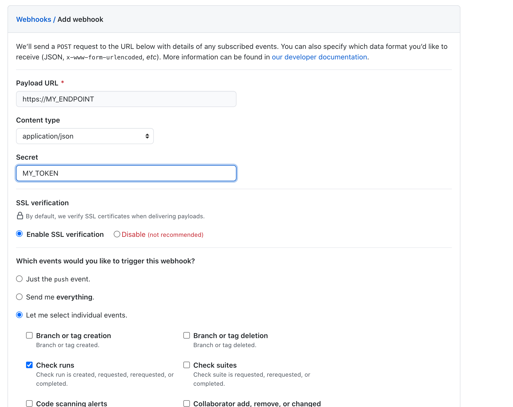

# GitHub Actions Exporter

Prometheus exporter exposing [GitHub Actions](https://github.com/features/actions) metrics.

Right now this exporter only expose the one metric which is the WorkFlow execution
time.

Other metrics can be added in the future.

## Getting Started

This exporter receives webhook events from GitHub.

If you want to collect metrics from a GitHub repository you will need to create a webhook
in your GitHub repo.

You need just to select the `Check Run` event and the set your secret (that you start your exporter, see below)

The webhook will call `/gh_event` path on your endpoint by default. You can change this with the `--web.gh-webhook-path` option.



Also it collects the Action Billing metrics, for that you will need to setup a GitHub API Access Token

The metrics are built from the GitHub [billing usage report](https://docs.github.com/rest/billing/usage) of the current month (enhanced billing platform), because the legacy Actions billing API was retired by GitHub:

- `actions_total_minutes_used_minutes`: all Actions minutes used.
- `actions_total_paid_minutes`: minutes that were charged.
- `actions_included_minutes`: minutes covered by the included quota or discounts (total minus paid). It is no longer the plan allowance, which the new API does not report.
- `actions_total_minutes_used_by_host_minutes`: minutes per runner type. The `host_type` label is `UBUNTU`, `WINDOWS` or `MACOS` for the standard runners, and the SKU (e.g. `actions_linux_4-core`) for larger runners.

When configuring for an organization, the Access token must belong to an administrator of the organization and the organization must be on the enhanced billing platform. When configuring for an user, the token must belong to that user.


### Prerequisites

To run this project, you will need a [working Go environment](https://golang.org/doc/install).

### Installing

```bash
go get -u github.com/cpanato/github_actions_exporter
```

## Building

Build the sources with

```bash
make build
```

## Run the binary

```bash
./github_actions_exporter --gh.github-webhook-token="MY_TOKEN" --gh.github-api-token="Accesstoken" --gh.github-org="honk_org"
```

## Docker

You can deploy this exporter using the [ghcr.io/cpanato/github_actions_exporter-linux-amd64](https://github.com/users/cpanato/packages/container/package/github_actions_exporter-linux-amd64) Docker image.

For example:

```bash
docker pull ghcr.io/cpanato/github_actions_exporter-linux-amd64:v0.2.0
docker run -d -p 9101:9101 ghcr.io/cpanato/github_actions_exporter-linux-amd64:v0.2.0 --gh.github-webhook-token="1234567890token" --gh.github-api-token="Accesstoken" --gh.github-org="honk_org"
```

## Testing

### Running unit tests

```bash
make test
```

### Manual testing

```bash
cd example/
export GITHUB_WEBHOOK_TOKEN="..."
export GITHUB_API_TOKEN="..."
export GITHUB_ORG="..."
docker-compose up --build
```

Open Prometheus at http://localhost:9090 and explore the available metrics.

## Contributing

Refer to [CONTRIBUTING.md](https://github.com/cpanato/github_actions_exporter/blob/master/CONTRIBUTING.md).

## License

Apache License 2.0, see [LICENSE](https://github.com/cpanato/github_actions_exporter/blob/master/LICENSE).
